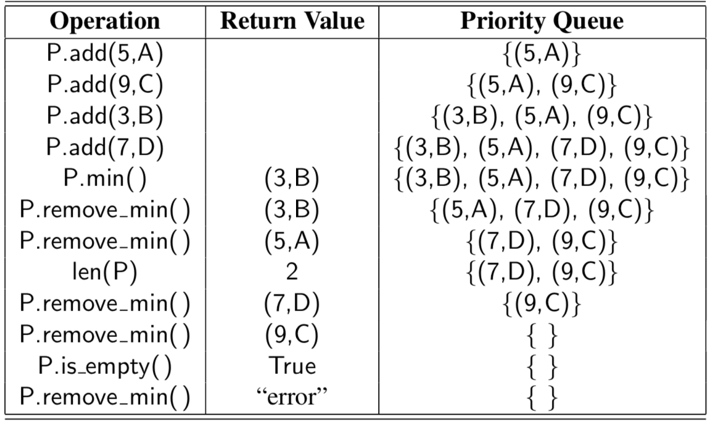

# Priority Queue

## Reasons

There are many applications in which a queue-like structure is used to manage objects that must be processed in some way, but for which the first-in, first-out policy does not suffice. Consider, for example, an air-traffic control center that has to decide which flight to clear for landing from among many approaching the airport. This choice may be influenced by factors such as each plane’s distance from the runway, time spent waiting in a holding pattern, or amount of remaining fuel. It is unlikely that the landing decisions are based purely on a FIFO policy.
There are other situations in which a “first come, first serve” policy might seem reasonable, yet for which other priorities come into play. To use another airline analogy, suppose a certain flight is fully booked an hour prior to departure. Be- cause of the possibility of cancellations, the airline maintains a queue of standby passengers hoping to get a seat. Although the priority of a standby passenger is influenced by the check-in time of that passenger, other considerations include the fare paid and frequent-flyer status. So it may be that an available seat is given to a passenger who has arrived later than another, if such a passenger is assigned a better priority by the airline agent.

## What is a Priority Queue

This is a collection of prioritized elements that allows arbitrary element insertion, and allows the removal of the element that has first priority. When an element is added to a priority queue, the user designates its priority by providing an associated key.

## Implemeneted Types

 - Unsorted Priority Queue with dffferent Big O notation

 - Sorted Priority Queue

### Comparing the Two List-Based Implementations

The running times of the methods of a priority queue
realized by means of a sorted and unsorted list respectively.
We see an interesting trade- off when we use a list to implement the priority queue ADT. An unsorted list supports fast insertions but slow queries and deletions, whereas a sorted list allows fast queries and deletions, but slow insertions.

Operation | Unsorted List | Sorted List
------------ | ------------- | ------------
len | O(1) | O(1)
is_empty | O(1) | O(1)
add | O(1) | O(n)
min | O(n) | O(1)
remove min | O(n) | O(1)
